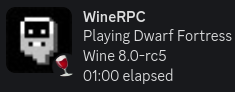

# WineRPC

A Discord rich presence support for [Wine](https://winehq.org)  
  


## How to Run

Install required dependencies

```sh
pip install -r requirements.txt
```

You can edit the existing appdb from this repository by editing the `apps.json` file, ex:

```json
[
  {
    "title": "ExampleApp",
    "exe": ["example.exe"],
    "icon": "https://example.com/icon.png"
  }
]
```

Run the `winerpc.py` script
make sure you have Discord opened.

```sh
python3 winerpc.py
```
